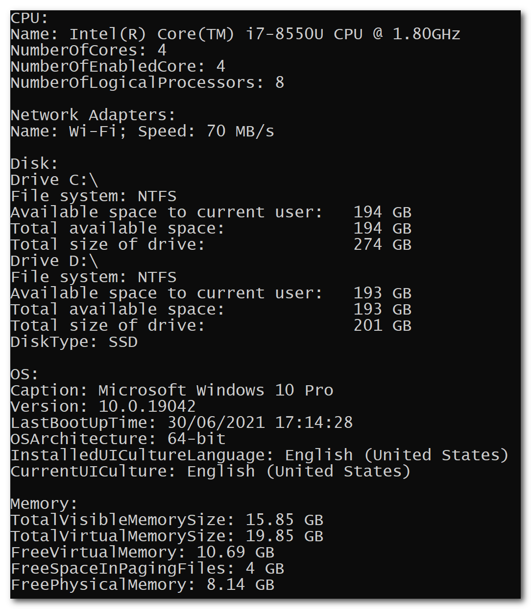

# GetSystemInfo
A quick way to get common system information, such as CPU, Memory, Harddisk, with Microsoft .NET Core v3.1 LTS, in C#.

# Motivation

Log files are important for troubleshooting. However, beside it, sometimes I kept asking my clients about their environment (hardware, software). Then I wondered why not I just print out every piece of system info I need also in the log files... When issues arises, I can simply say to the clients: "Please give me the log file."

# Example

**Note**: I don't know why `FreeVirtualMemory` is not equal to the combination of `FreeSpaceInPagingFiles` and `FreePhysicalMemory`. :confused:
